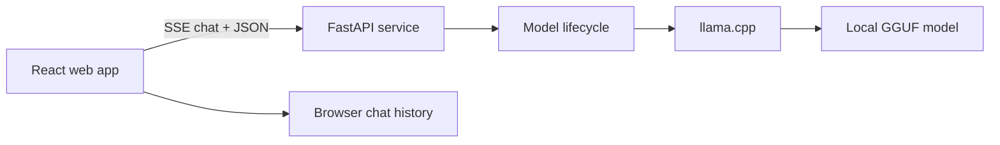

# LocalChat

LocalChat is a private AI workspace that runs GGUF language models on your own computer. It is designed for people who want an approachable chat experience without sending prompts or conversation history to a cloud AI provider.

   

## What changed in 2.0

- Guided model setup with automatic discovery of `.gguf` files
- Multi-turn conversations with locally persisted chat history
- Token-by-token streaming, Stop, Regenerate, and Copy controls
- Safe Markdown rendering with tables, lists, and code blocks
- Model-agnostic llama.cpp chat templates instead of a Qwen-specific prompt
- Environment-based configuration with no machine-specific paths
- Model lifecycle, health, request validation, and user-safe errors
- Responsive, accessible interface with no remote font or analytics requests
- Backend and frontend tests, linting, CI, and container support

## Quick start on Windows

The release package includes the built interface. Install Python 3.10–3.12, place a GGUF instruction/chat model in the `models` folder, then double-click `start-windows.bat`. It prepares the environment, starts LocalChat, and opens the app for you.

For a source checkout, you can also set everything up manually. You need Python 3.10–3.12 and Node.js 22+.

```powershell
# 1. Create and activate a Python environment
python -m venv .venv
.\.venv\Scripts\Activate.ps1

# 2. Install the backend
python -m pip install --upgrade pip
pip install -r requirements.txt

# 3. Install and build the interface
cd frontend
npm install
npm run build
cd ..

# 4. Add your model
mkdir models
# Copy your .gguf file into the models folder

# 5. Start LocalChat
python main.py
```

Open [http://127.0.0.1:8000](http://127.0.0.1:8000), choose **Model & settings**, then select the model you added. macOS and Linux users can run `chmod +x start-macos-linux.sh && ./start-macos-linux.sh`.

> PowerShell may block activation scripts on some computers. You can run `.\.venv\Scripts\python.exe -m pip install -r requirements.txt` and `.\.venv\Scripts\python.exe main.py` without activating the environment.

## Development

Run the backend and frontend in separate terminals:

```bash
# Terminal 1 — API
pip install -r backend/requirements-dev.txt
LOCALCHAT_ENVIRONMENT=development python main.py

# Terminal 2 — web app
cd frontend
npm install
npm run dev
```

The web app is available at `http://127.0.0.1:5173`; Vite proxies `/api` to the backend.

## Configuration

Copy `.env.example` to `.env`. Every option uses the `LOCALCHAT_` prefix.

| Variable | Default | Purpose |
| --- | --- | --- |
| `LOCALCHAT_HOST` | `127.0.0.1` | Keeps the app limited to your computer by default |
| `LOCALCHAT_PORT` | `8000` | Local web and API port |
| `LOCALCHAT_OPEN_BROWSER` | `false` | Opens the local app automatically after startup |
| `LOCALCHAT_MODELS_DIR` | `./models` | Folder scanned recursively for GGUF files |
| `LOCALCHAT_DEFAULT_MODEL` | empty | Model ID to load automatically at startup |
| `LOCALCHAT_CONTEXT_SIZE` | `4096` | Model context window |
| `LOCALCHAT_THREADS` | CPU count minus one | CPU threads used by llama.cpp |
| `LOCALCHAT_GPU_LAYERS` | `0` | Layers offloaded to a supported GPU; use `-1` for all |
| `LOCALCHAT_CORS_ORIGINS` | local Vite addresses | Comma-separated development origins |

Do not expose the backend to an untrusted network without adding authentication and a network security layer. The default loopback host is intentional.

## Architecture



- `frontend/src/components` contains product UI components.
- `frontend/src/lib` owns API streaming and browser persistence.
- `backend/app/api` defines the HTTP contract.
- `backend/app/services` owns model discovery, loading, and inference.
- `backend/tests` runs without loading a real model by using a deterministic fake service.

API documentation is available locally at `http://127.0.0.1:8000/api/docs`.

## Quality checks

```bash
# Backend
pytest
ruff check .

# Frontend
cd frontend
npm run lint
npm run test
npm run build
```

## Privacy boundaries

- Prompt processing and inference are local.
- Conversation history is stored in the current browser's local storage.
- The app contains no analytics, telemetry, remote fonts, or cloud AI calls.
- Your operating system, browser extensions, downloaded model, or reverse proxy can have separate privacy behavior; evaluate those independently.

## License

MIT — see [LICENSE](LICENSE).
